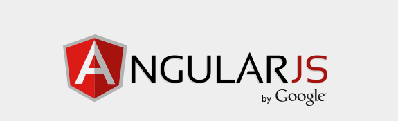

___
#### Rappel :
Ne partez pas avec l’idée que jQuery peut faire X, Y ou Z, et qu’il suffira d’ajouter AngularJS au dessus pour les modèles et les contrôleurs. C’est très tentant lorsque l’on débute, c’est pour cela que je recommande aux nouveaux développeurs AngularJS de ne pas du tout utiliser jQuery, au moins le temps de se familiariser avec « l’Angular Way ».

J’ai vu beaucoup de développeurs créer des solutions très élaborées de 150 ou 200 lignes avec des plugins jQuery, qu’ils collent dans AngularJS avec des callbacks et des $apply, ce qui donne quelque chose de très compliqué et d’illisible, mais qui fonctionne ! Le problème est que dans la majorité des cas, ce plugin jQuery aurait pu être réécrit en AngularJS en quelques lignes, ce qui au passage, rendrait le code bien plus compréhensible.

Ce qu’il faut retenir de tout ça : Pensez d’abord en AngularJS ; si vous ne trouvez pas, demandez à la communauté ; et si après tout cela vous n’avez pas trouvé de solution simple, alors vous pouvez utiliser jQuery. Mais ne comptez pas trop sur jQuery ou vous ne maitriserez jamais AngularJS.

#### On pense architecture avec Angular.js :
Tout d’abord ayez en tête que les « single-page applications » sont avant tout des applications. Ce ne sont pas des pages web. Donc vous devez penser comme un développeur server-side en plus de penser comme un développeur client-side. Vous devez trouver comment diviser votre application en composants individuels, extensibles, et testables.

Comment fait-on cela ? Comment penser en AngularJS ? Voici les concepts principaux, comparés avec jQuery.

+ La "view" est la reine :
	* avec `jQuery`:
	
	``` 
	<ul class="main-menu">
    <li class="active">
        <a href="#/home">Home</a>
    </li>
    <li>
        <a href="#/menu1">Menu 1</a>
        <ul>
            <li><a href="#/sm1">Submenu 1</a>
            </li>
            <li><a href="#/sm2">Submenu 2</a>
            </li>
            <li><a href="#/sm3">Submenu 3</a>
            </li>
        </ul>
    </li>
    <li>
        <a href="#/home">Menu 2</a>
    </li>
</ul>
```
le js:

```
$('.main-menu').dropdownMenu();
```
Quand on regarde juste la view, il n’est pas évident de voir que quelque chose ici est dynamique. Pour de petites applications, ça va, mais pour des applications de taille conséquente, c’est un peu plus déroutant et difficile à maintenir.

Avec `Angular.js` en revanche, la view est le « record » officiel. Notre ul ressemblerait plus à quelque chose comme ça :

```
	<ul class="main-menu" dropdown-menu>
    ...
	</ul>
```
+ Les deux morceaux de code font la même chose, mais dans la version AngularJS, n’importe qui peut comprendre en un coup d’oeil ce qui se passe dans le template. Quand un nouveau développeur rejoint l’équipe, il peut comprendre instantanément qu’il y a une directive dropdown-menu. Il n’a pas besoin de le deviner, ou de fouiller dans le code. La view nous renseigne sur ce qu’il doit se passer. Bien plus propre.

+ Les développeurs qui découvrent AngularJS posent souvent la question suivante : Comment faire pour trouver tous les éléments similaires pour leur attribuer une directive ? Le développeur est en général très étonné quand on lui dit qu’on ne peut pas. On ne fait pas ainsi, car cela reviendrait à faire du mi-jQuery, mi-AngularJS. Le problème est que le développeur essaie de faire du jQuery dans un contexte AngularJS. La view est le « record » officiel. En dehors d’une directive (plus d’explications un peu plus loin), vous ne devez jamais changer le DOM. D’ailleurs les directives sont appliquées dans la view, ce qui rend les choses bien claires.
# DATA BINDING :
C’est de loin la plus géniale des fonctionnalités d’AngularJS, elle permet d’ailleurs de nous épargner pas mal de manipulations de DOM dont je parlais un peu plus haut. AngularJS mettra à jour la view automatiquement, sans que vous ayez à intervenir ! En jQuery, on répond à des événements, et à partir de là on met à jour le contenu. Par exemple :
* `jQuery`:

```
$.ajax({
    url: '/myEndpoint.json',
    success: function(data, status) {
        $('ul#log').append('&lt;li&gt;Data Received!&lt;/li&gt;');
    }
});
```
Pour une simple "view" comme celle-là:

```
	<ul class="messages" id="log">
	</ul>
```
Déjà on mélange tout, mais plus important, on doit mettre à jour manuellement l’élément du DOM. Comment tester la logique en faisant abstraction du DOM ? Et que ce passe-t’il si on veut changer le HTML ?

Ce n’est pas très élégant, mais en AngularJS, on peut faire ceci :

```
 <div class="messages">
    <div class="alert" ng-repeat="entry in log">
        {{ entry.msg }}
    </div>
 </div>
```
# L’injection de dépendances (dependency injection ou DI):

Pour nous aider dans la « separation of concerns », il y a l’injection de dépendances. Si vous avez de l’expérience dans un language server-side (Java, PHP…), vous êtes sûrement déjà familier avec le concept, mais si vous êtes plutôt habitué à jQuery ce concept peut paraitre superflu. Mais ça ne l’est pas.

Globalement, l’injection de dépendances signifie que vous pouvez déclarer un composant un peu n’importe où, puis depuis n’importe quel composant en demander une instance. Vous n’avez pas à vous occuper de l’ordre des déclarations ou de l’emplacement des fichiers. L’intérêt n’est pas forcement visible au premier abord, mais voici juste un exemple : Les tests.

Disons que dans notre application, on utilise un service qui gère le stockage des données côté serveur via une API REST, ou selon le contexte, utilise le localStorage. Quand on lance nos tests sur notre contrôleur, on ne veut pas communiquer avec le serveur, on teste le contrôleur après tout. On peut juste ajouter un service « mock » du même nom que le composant, et l’injecteur s’assurera que le contrôleur utilise bien le faux ; notre contrôleur n’a pas à connaitre le différence.

A propos de tests…
## Le développement guidé par les tests (TDD) – Toujours :+1:
De tous les plugins jQuery que vous avez vu, utilisé, ou même écrit, combien d’entre eux étaient accompagnés de tests ? Très peu, car jQuery ne se prête pas vraiment à cette pratique, mais AngularJS oui.

En jQuery, le seul moyen de faire des tests est de créer un composant à part, avec une page de démo sur laquelle les tests pourront faire de la manipulation du DOM. Puis on devrait créer un composant séparément que l’on intègrerait dans notre application. Vraiment pas très pratique ! Donc la plupart du temps, en jQuery, on développe de manière itérative et non en TDD.

Mais puisqu’en AngularJS on a la « separation of concerns », on peut développer de manière itérative et en TDD ! Par exemple, disons que nous voulions une directive qui nous indiquerait quelle est notre route actuelle. On peut déclarer n’importe quoi dans notre view, par exemple :

`<a href="/hello" when-active>Hello</a>`
Puis, on peut écrire notre test :

	
	it('should add "active" when the route changes', inject(function() {
    var elm = $compile('<a href="/hello" when-active>Hello</a>')($scope);
 
    $location.path('/not-matching');
    expect(elm.hasClass('active')).toBeFalsey();
 
    $location.path('/hello');
    expect(elm.hasClass('active')).toBeTruthy();
	}));
	
# Conclusion :
N’utilisez pas jQuery. Ne l’importez même pas. Ça vous ralentirait. Et quand vous rencontrez un problème que vous pensez pouvoir régler avec jQuery, avant d’utiliser $, essayez plutôt de trouver une solution en Angular. Et si vous ne trouvez pas, demandez ! 19 fois sur 20, la meilleure manière de faire n’a pas besoin de jQuery.
Maintenant vous savez un peu plus de chose.
___
#### Lexique:

###ng-app
La directive ng-app permet de dire à AngularJs qu’il doit être actif sur cette section de la page. Dans notre cas, il s’agit de toute la page puisqu’elle est située sur la balise <html>, mais on pourrait très bien la mettre sur un <div> par exemple.

###ng-controller
Cette section de la page est gérée par le contrôleur MainCtrl (notez la majuscule). Les variables et fonctions déclarées dans le scope de ce contrôleur sont accessibles dans cette zone du html, et pas en dehors.

###{{}}
Tout ce qui est entre doubles accolades sera interprété. Les variables et fonctions du contrôleur sont utilisables ici. Si les données changent dans le contrôleur, les changements seront répercutés sur la vue. C’est du one-way data binding. Dans l’exemple ci-dessus, {{title}} affiche simplement le contenu de $scope.title.

###ng-model
C’est une des « killer features » d’AngularJs, c’est ce que l’on appelle du two-way data binding. Si les données sont mises à jour dans le contrôleur, les changements seront répercutés dans la vue, et si les données sont mises à jour dans la vue, les changements seront répercutés dans le contrôleur! Dans l’exemple ci-dessus, l’utilisateur tape du texte dans l’input, ce qui met à jour la variable $scope.name du contrôleur, et le changement est instantanement répércuté côté vue dans {{name}}.

###$scope
Le scope est ce qui fait le lien entre le contrôleur et la vue. Techniquement c’est un objet javascript, et les propriétés qu’on lui ajoute (variables et fonctions) sont accessibles dans la vue, elles sont en quelque sorte publiques. Mais il est également possible de créer des variables et des fonctions privées (pas accessibles dans la vue).

	//Public (accessible dans le contrôleur et dans la vue)
	$scope.maVariable = "Hey";
	$scope.maFonction = function () {
    return 1;
	};
 
	//Privé (accessible seulement dans le contrôleur)
	var maVariable2 = "Hey";
	var maFonction2 = function () { //Une première manière de déclarer une fonction
    return 2;
	};
	function maFonction3() { //Une deuxième manière de déclarer une fonction
    return 3;
	};
	
##FAQ
####« Ça marche pas »
Pensez bien à mettre ng-app au début de votre application. L’oubli de cette directive (nous reviendrons sur ce terme) est la plus grande source d’erreur lorsque l’on débute.

####Ai-je besoin d’un serveur pour utiliser AngularJs?
Pour faire une application simple, vous n’avez pas besoin de serveur. Vous en aurez besoin si vous souhaitez que votre application comporte plusieurs pages.

####Est-ce que je peux utiliser jQuery avec AngularJs?
Si vous débutez sur AngularJs, il est vivement conseillé de ne pas utiliser jQuery le temps de vous familiariser avec l’esprit Angular.

#(pour info)
AngularJs embarque une version allégée de jQuery appelée jQlite, avec laquelle vous pouvez utiliser quelques unes des fonctions les plus courantes de jQuery telles que addClass(), find(), val()… Pour ce faire, remplacer le $ (ou jQuery) par angular.element

	//Avec jQuery
	$( "select.foo" ).val();
	//Avec AngularJs (Attention, ce n'est qu'un exemple!)
	//Ce n'est pas la bonne manière d'utiliser un select en angular
	angular.element("select.foo").val();

Si malgré tout, vous souhaitez utiliser jQuery, vous le pouvez, et sachez que toutes les méthodes seront accessibles via angular.element
	