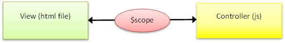

> Started from the bottom now we here !!

#les concepts de base d'angular.js
###1. Télécharment: [angular.js](https://angularjs.org/)

###2. Intégration :
Si le fichier est stocké en local :

	Juste avant la fermeture du head de la page
	
	</head>
ou 
	
	
	</head>
	
Quoi qu'en disent certains, il est préférable d'intégrer AngularJS le plus tôt possible dans la page, pour ne pas voir apparaître la page avant l'exécution des scripts Angular présents.

###3. Premiers pas :
Le bon vieux hello.world des familles:

	<!DOCTYPE html>
	<html>
	<head>
	<meta charset="UTF-8">
	<title></title>
	
	</head>
	<body>
    

          Message : {{message}}
    

 
    
	</body>
	</html>

* `ng-app` ou `data-ng-app` définit l'application (vide pour l'instant)
* `ng-controller` ou `data-ng-controller` définit la zone d'action (la div dans l'exemple) d'un contrôleur
* Les accolades `{{ et }}` définissent une expression et mettent en oeuvre le data-binding entre vue (HTML) et contrôleur (fonction javascript)

####Hello world modifié

On change maintenant la portée du contrôleur (sur balise html de la page), et on ajoute de quoi modifier le destinataire du Hello `aQui` via un champ input, pour illustrer la notion de data-binding (avec la directive `ng-model)

	<!DOCTYPE html>
	<html ng-app="" ng-controller="hello">
	<head>
	<meta charset="UTF-8">
	<title>{{message}}</title>
	
	</head>
	<body>
    

        Message : <input type="text" ng-model="aQui"> 
          Hello {{aQui}}
    

 
    
	</body>
	</html>
> Afficher le résultat dans le navigateur, modifiez la valeur du champ input, et constatez les changements...

###Les principaux concepts:
####- Les directives :
	
Les directives AngularJs permettent de marquer les éléments du DOM (attributs, noms, commentaires, classes CSS…) de façon à indiquer au compilateur AngularJs ($compile) d'associer un comportement à ces éléments DOM ou à les modifier.

La “compilation” consiste à attacher des listeners au éléments HTML pour les rendre interactifs.
	
	exemple 1
	

 
	
Prénom : <input type="text" ng-model="prenom">

	
Vous avez saisi : {{ prenom }}

 
	

	
Liste des directives de l'exemple :

* `ng-app` initialise une application AngularJS.
* `ng-init` initialise les données d'une application.
* `ng-model` associe à la valeur de contrôles HTML (input, select, textarea) les données de l'application (data-binding).

		exemple 2
		

    	

        <label><input type="radio" ng-value="client.id" name="client">{{ client.nom + ', ' + client.pays }}</label>
    	

		

	Liste des directives de l'exemple :

* `ng-init` initialise les données (tableau d'objets).
* `ng-repeat` répète une séquence HTML en exécutant un foreach sur le tableau clients.
* `ng-value` définit la valeur de chaque case d'option, à partir de l'id de chaque client

la documentation sur les : [directives](https://docs.angularjs.org/guide/directive)

###Les expressions :

Les expressions permettent de mettre en oeuvre le data-binding, comme la directive ng-model, mais ne se limitent pas aux éléments HTML de saisie. Définies par les balises {{uneExpression}}, elles sont directement insérées dans la page HTML.

Les expressions angular peuvent contenir des variables, des opérateurs, ou des expressions littérales. Elles n'ont pas accès à l'ensemble des variables d'une page (window, document), mais uniquement à une portée locale : le `$scope`

	exemple
	
Vous avez saisi : {{ prenom }}

un autre

	exemple
	
  	1+2={{1+2}}
	

la documentation sur les :[expressions](https://docs.angularjs.org/guide/expression)
### Les filtres :
Les filtres permettent de formater/modifier l'affichage d'une expression :
	
	exemple
	
Vous avez saisi : {{ prenom | uppercase}}

sinon

	exemple
	
  	1+2={{1+2 | currency}}
	

###Modules :
Un module est un conteneur d'éléments pour une application : services, directives, filtres, contrôleurs. Chaque module d'une application correspond logiquement à une fonctionnalité.

Déclaration d'un module dans un fichier js :
	
	var myAppModule = angular.module('myApp', []);
Utilisation dans une vue HTML via la directive `ng-app` :

	

  	...
	

Documentation sur les : [modules](https://docs.angularjs.org/guide/module)

###Contrôleurs:

Les contrôleurs permettent d'associer une logique métier aux vues.
Un contrôleur est défini par un constructeur permettant d'augmenter la portée (le scope) d'AngularJs, il peut utiliser des services, par injection de dépendance.

Exemple en dehors d'un module :

	

 
	Nom : <input type="text" ng-model="nom"> 
	Prénom : <input type="text" ng-model="prenom"> 
	 
	Nom et prénom : {{nomComplet()}}
 
	

 
	
Exemple de contrôleur dans un module :

	apps.js
	var myApp = angular.module('myApp',[]);
 
	myApp.controller('CarreController', ['$scope', function($scope) {
    $scope.value=0;
    $scope.carre = function(value) { return value * value; };
	}]);
L'injection de dépendance est utilisée pour spécifier la dépendance du contrôleur au service Angular $scope, qui définit la portée du contrôleur.
La vue associée est la suivante :

	<fieldset data-ng-app="myApp" data-ng-controller="CarreController">
    <legend>Carré</legend>
    <input type="text" data-ng-model="value">
    
Carré : {{carre(value)}}

	</fieldset>
	
Elle fait référence à la donnée du modèle `value`, initialisée dans le contrôleur, et doublement référencée dans la vue :

* avec la directive `ng-model` du champ input
* dans l'expression `{{carre(value)}}`

documentation pour les : [controller](https://docs.angularjs.org/guide/controller)

###$scope :
Le scope définit une portée, notion rattachée aux contrôleurs, ou à certaines directives (ng-repeat par exemple).
Pour en comprendre le fonctionnement, implémenter l'exemple suivant :

	scope:v_scope.html
	<!DOCTYPE html>
	<html>
	<head>
	<meta charset="UTF-8">
	<title>scope</title>
	
	
	
	</head>
	<body>
 
    

        <label for="root">Scope racine</label> <input type="text" id="root"
            placeholder="Entrez du texte" ng-model="message">
        

            <label for="ctrl">Scope enfant</label> <input type="text" id="ctrl"
                placeholder="Entrez du texte" ng-model="message">
        

    

	</body>
	</html>
	 
le fichier `apps.js`:

	angular.module('ScopeModule', []);
	angular.module("ScopeModule").controller("ScopeController", [ "$scope", function($scope) {
     
	} ]);
	
Testez la vue v_scope.html :

* Entrez une valeur dans la première zone de texte (scope parent), remarquez la valeur de la seconde zone (scope enfant)
* Modifiez la valeur de la seconde zone, remarquez la valeur de la première
* Rechargez la page, entrez une valeur dans la seconde zone, entrez une valeur dans la première zone : que remarquez vous ?
* Expliquez la raison de ce fonctionnement
* Ajoutez dans le contrôleur le code permettant de rendre les 2 zones toujours dépendantes.

###Services :
Les services peuvent être utilisés pour structurer une application et partager du code entre ses différents modules.
Un service est un objet (singleton) chargé à la demande (lazy loading).

AngularJs propose ses propres services, préfixés du $ : $scope, $window… utilisables par injection de dépendance.

Documentation sur les : [services](https://docs.angularjs.org/api/ng/service)

###Exemple d'utilisation du service `$window`
Injection du service `$window` dans un contrôleur `GotoController` de notre module `myApp` :
Le contrôleur permet d'accéder à une URL.

	app/apps.js
	myApp.controller('GotoController', [ '$scope','$window',function($scope,win) {
    $scope.location="http://www.google.fr";
    $scope.go=function(){win.location=$scope.location;};
	} ]);
et 

	v_goto.html
	<!DOCTYPE html>
	<html data-ng-app="myApp">
	<head>
	<meta charset="UTF-8">
	<title></title>
	
    
	</head>
	<body data-ng-controller="GotoController">
	<input type="text" data-ng-model="location">
	<input type="button" data-ng-click="go()" value="Go"/>
	</body>
	</html>
####Création d'un service
Le service créé : `browser`, va permettre de détecter le navigateur utilisé :
	
	app/apps.js
	myApp.service('browser', [ '$window', function($window) {
 
    this.get= function() {
 
        var userAgent = $window.navigator.userAgent;
        var browsers = {
            chrome : /chrome/i,
            safari : /safari/i,
            firefox : /firefox/i,
            ie : /internet explorer|.net/i
        };
 
        for ( var key in browsers) {
            if (browsers[key].test(userAgent)) {
                return key;
            }
        };
        return 'Navigateur inconnu';
    };
 
	} ]);
Création d'un contrôleur utilisant le service `browser`, par injection de dépendance :

	app/apps.js
	myApp.controller('BrowserController', [ '$scope','browser',function($scope,browser) {
    $scope.navigateur= browser.get();
	} ]);

Utilisation du contrôleur dans une vue :

`
{{navigateur}}
`

	

	