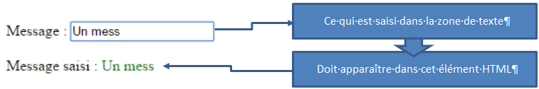

## Sensibilisation : 
Pas toujours évident de voir l'intérêt d'utiliser un framework ; Surtout si on a jamais eu, auparavant, l'occasion de travailler sur les mêmes sujets, mais sans framework…

Voici un exemple minimaliste permettant de se rendre compte de l'intérêt d'AngularJS :

Il s'agit de synchroniser un texte contenu dans la page avec une saisie effectuée dans une zone de texte : tout simple !

### Du JS sans framework:

	<!DOCTYPE html>
	<html>
		<head>
		<meta charset="UTF-8">
	<title>javascript</title>
	</head>
	<body>
    <h1>Javascript</h1>
    

        Message : <input id="txtMessage" type="text"> 
          Message : 
    

	
	</body>
	</html>
	
Il nous faut :

* Intercepter le chargement terminé du DOM de la page (c'est à l’événement `DOMContentLoaded` de nous le dire) : sans cette précaution (pas vraiment indispensable sur cette exemple), il se pourrait que l'on agisse sur des éléments non encore chargés…
* une fonction pour modifier le texte contenu dans un élément HTML : `setTextContent`
* une fonction pour ajouter un listener sur un événement d'un élément DOM : `addEvent`
* une fonction pour synchroniser la zone de texte et l'élément HTML : `changeFunction`
Ajouter l'écoute des événements `keyup` et `paste` qui impliquent une modification de la zone de texte, et ajouter un temps d'attente sur le paste, pour qu'il se soit terminé avant l'appel de changeFunction
> Certaines de ces fonctions pourraient être réutilisées ailleurs (et donc délocalisées), mais l'ensemble est tout de même laborieux, et technique.

### Avec jQuery :

	<!DOCTYPE html>
	<html data-ng-app>
	<head>
	<meta charset="UTF-8">
	<title>JQuery</title>
		
	</head>
	<body>
    <h1>JQuery</h1>
    

        Message : <input id="txtMessage" type="text"> 
          Message : 
    

	
	</body>
	</html>
	
Il faut :

* Agir lorsque le dom de la page est chargé : `$( document ).ready`
* Créer un événement postpast, pour agir après que le “coller” d'un texte se soit produit (c'est ce qu'on appelle un trick : bricolage ou astuce…)
* Associer du code aux événements `keyup` et `postpaste, pour synchroniser le contenu de la zone de texte et de l'élément HTML
> Le code est propre, mais la technicité masque l'approche métier : difficile d'identifier au premier coup d’œil le rôle de ces lignes

### Avec Angular.js :
	<!DOCTYPE html>
	<html data-ng-app>
	<head>
	<meta charset="UTF-8">
	<title>AngularJS</title>
	<script
    src="http://ajax.googleapis.com/ajax/libs/angularjs/1.3.8/angular.min.js"></	script>
	</head>
	<body>
    	<h1>AngularJS</h1>
    

        Message : <input type="text" data-ng-model="message"> 
          Message : {{message}}
    

	</body>
	</html>

Il faut :

* Définir la portée de notre application : `<html data-ng-app>`
* Déclarer que la zone de texte est synchronisée sur le model message : `data-ng-model=“message”`
* Invoquer message avec une expression dans l'élément HTML : `{{message}}`
> Une approche très propre, orientée métier...
Impressionnant non ?
