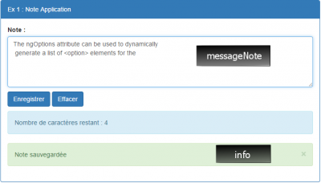
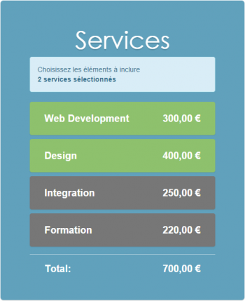
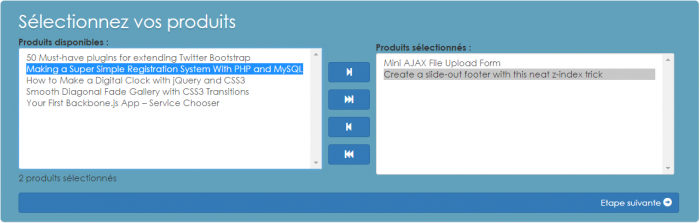
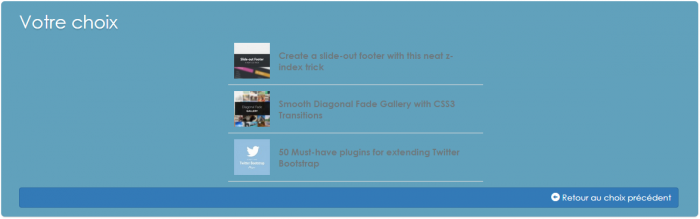
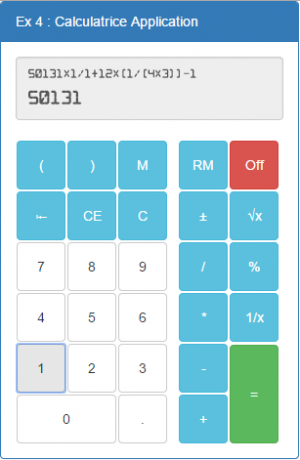

### Il est temps de faire de la gym :

 

Tous les exercices utilisent `Bootstrap` pour la partie CSS.
 [URL](https://maxcdn.bootstrapcdn.com/bootstrap/3.3.1/css/bootstrap.min.css)
 
> Allez on y est!

Créer un dossier différent pour chaque exercice, dans le même projet.

##Exo1 => Application Note :
* Objectif:
	* Créer un module et un contrôleur
	* Utiliser des directives Angular
	* Mettre en oeuvre le Data-binding
	
* Fonctionnalités:
	* Saisir une note (message textuel) et afficher le nombre de caractères restants (le message est limité à 100 caractères saisis)
	* Enregistrer (côté client en JS)
	* Effacer le contenu
	* Afficher les messages d'info (sauvegarde, modification…)
	* Gérer les changements de classe CSS sur l'affichage d'info
* Application/Contrôleurs:

Application |  Contrôlleur|
------------| ------------- | 
`NoteApp` (app/noteApp.js)| `NoteController` (app/noteController.js)  | 
| `MessageNote` : variable stockant le contenant de la note   | 
|`info` :message affiché (modifié,sauvegardé...) |
|`save()` :Met à jour le modèle (messageNote) |
|`clear()`:vide messageNote |
|`count()` :calcule le nombre de caractères restants (sur 100) |

* Vue:
	* Directive utilisées:
		* `ng-app`
		* `ng-change`
		* `ng-controller`
		* `ng-click`
		* `ng-model`
		* `ng-bind`
		* `ng-class`
		
	* INTERFACE :
	
	
	
> Libre à vous de l'amélioré hein!
	
   * Logique applicative / comportement de l'interface
   	* sur saisie dans la zone `messageNote` (textarea), le nombre de caractères restants est indiqué
		* la zone info apparaît et indique “note modifiée” dès que `messageNote` est modifié, avec le style `alert-warning`
		*  Le style de la zone info passe à `alert-danger` si le nombre de caractères restant est inférieur à 10
	* Sur enregistrement (à condition que le message ne soit pas vide) :
		* la zone `info` affiche “note sauvegardée” et sont style passe à `alert-success`
	* Sur effacement (à condition que le message ne soit pas vide) :
		* la zone `info` disparaît
	
##Exo2 => Choix de services:
 * Objectifs

	* Créer un module et un contrôleur
	* Utiliser des directives Angular
	* Mettre en oeuvre le Data-binding
- Fonctionnalités

	* Sélectionner/désélectionner des services.
	* Calculer le montant dû.
	* Afficher le nombre de services sélectionnés.
- Application/Contrôleurs:

Application |  Contrôlleur|
------------| ------------- | 
`ServicesApp` (app/servicesApp.js)| `ServicesController` (app/servicesController.js)  | 
| `services` : Tableau des services disponibles défini en JSON| 
|`total()`: Calcul le total des services actifs|
|`toggleActive()`:Change le statut d'un service |

`Services` : à intégrer dans le contrôleur

	[
    {
        name: 'Web Development',
        price: 300,
        active:true
    },{
        name: 'Design',
        price: 400,
        active:false
    },{
        name: 'Integration',
        price: 250,
        active:false
    },{
        name: 'Formation',
        price: 220,
        active:false
    }
	]
Ressources : [fichers zone fr](./fr.zip)

##- Vue :

* Directives utilisées:
	* ng-app
	* ng-controller
	* ng-repeat
	* ng-class
	* ng-pluralize
	* Expressions {{expression}}
Filtre : currency
* INTERFACE :

* Logique applicative / comportement de l'interface

	* Le service `Web development` est sélectionné par défaut
	* La classe css d'un service sélectionné est égale à `active`
	* La sélection/dé-sélection met à jour l'affichage du nombre de services sélectionnés, ainsi que le `total`
 
 
___
##Exo3 = choix multiples

### Objectifs:
* Créer un module et un contrôleur
* Utiliser des directives Angular
* Mettre en oeuvre le Data-binding
### Fonctionnalités
	* Lister les produits disponibles
	* Ajouter un ou plusieurs produits disponibles aux produits sélectionnés
	* Ajouter tous les produits disponibles aux produits sélectionnés
	* Retirer un ou plusieurs produits sélectionnés
	* Retirer tous les produits sélectionnés
	* Valider le choix de produits sélectionnés
	* Revenir au choix des produits

### Application/Contrôleurs

Application |  Contrôlleur|
------------| ------------- | 
`ListesApp` (app/listesApp.js)| `ListesController` (app/listesController.js)  | 
| `dispoItems` : Tableau des produitsdéfini en JSON (utiliser le service $http)| 
|`includesItems`: Tableau des produits à inclure|
|`selectedDispoItems`:Tableau des éléments sélectionnés |
|`selectedIncludedItems`: Tableau des éléments dans la liste des produits à inclure|
|`step` : Variable d'état agissant sur les vues et prenant les valeurs 1: choix des produits ou 2 : visualisation du choix |
|`addToIncluded()`: ajoute tous les produits en surbrillance (`selectedDipoItems`) à la liste des produits à inclure (`includedItems`)|
|`addAllToIncluded()`: ajoute tous les produits disponibles(`dispoItems`) à la liste produits à inclure(`includedItems`) |
|`removeFromIncluded()`: Retire tous les produits sélectionnés en surbrillance (`selectedDipoItems`) à la liste des produits à inclure (`items`)|
|`removeAllFromIncluded()`: retire tout les produits à inclure (`includedItems`) pour les remettre dans la liste des produits disponibles(`items`)|

`dispoItems` à intégrer dans un contrôleur :

		[
        {
            "url": "http://tutorialzine.com/2013/07/50-must-have-plugins-for-extending-twitter-bootstrap/",
            "title": "50 Must-have plugins for extending Twitter Bootstrap",
            "image": "http://cdn.tutorialzine.com/wp-content/uploads/2013/07/featured_4-100x100.jpg"
        },
        {
            "url": "http://tutorialzine.com/2013/08/simple-registration-system-php-mysql/",
            "title": "Making a Super Simple Registration System With PHP and MySQL",
            "image": "http://cdn.tutorialzine.com/wp-content/uploads/2013/08/simple_registration_system-100x100.jpg"
        },
        {
            "url": "http://tutorialzine.com/2013/08/slideout-footer-css/",
            "title": "Create a slide-out footer with this neat z-index trick",
            "image": "http://cdn.tutorialzine.com/wp-content/uploads/2013/08/slide-out-footer-100x100.jpg"
        },
        {
            "url": "http://tutorialzine.com/2013/06/digital-clock/",
            "title": "How to Make a Digital Clock with jQuery and CSS3",
            "image": "http://cdn.tutorialzine.com/wp-content/uploads/2013/06/digital_clock-100x100.jpg"
        },
        {
            "url": "http://tutorialzine.com/2013/05/diagonal-fade-gallery/",
            "title": "Smooth Diagonal Fade Gallery with CSS3 Transitions",
            "image": "http://cdn.tutorialzine.com/wp-content/uploads/2013/05/featured-100x100.jpg"
        },
        {
            "url": "http://tutorialzine.com/2013/05/mini-ajax-file-upload-form/",
            "title": "Mini AJAX File Upload Form",
            "image": "http://cdn.tutorialzine.com/wp-content/uploads/2013/05/ajax-file-upload-form-100x100.jpg"
        },
        {
            "url": "http://tutorialzine.com/2013/04/services-chooser-backbone-js/",
            "title": "Your First Backbone.js App – Service Chooser",
            "image": "http://cdn.tutorialzine.com/wp-content/uploads/2013/04/service_chooser_form-100x100.jpg"
        }
    ]

###VUE:
* Directives utilisées:
	* ng-app
	* ng-controller
	* ng-repeat
	* ng-options
	* ng-pluralize
	* ng-click
	* ng-dblclick
	* ng-src
	* Expressions {{expression}}
	
### Interface :
#### Etape 1:

#### Etape 2:

### Logique applicative / comportement de l'interface :

* Les 4 boutons d'ajout ou de retrait des services à inclure s'activent ou se désactive (disabled) en fonction du contenu des listes et/ou des éléments sélectionnés
	* bouton ▶| : ajoute le(s) élément(s) sélectionnés de la liste de gauche à la liste de droite
	* bouton ▶▶| : ajoute tous les éléments sélectionnés de la liste de gauche à la liste de droite
	* bouton |◀ : retire le(s) élément(s) sélectionnés de la liste de droite et les place dans la liste de gauche
	* bouton |◀◀ : retire tous les éléments sélectionnés de la liste de droite et les place dans la liste de gauche
* Un double clic sur l'un des éléments des 2 listes ajoute ou retire l'élément et le passe dans la liste associée
* Le nombre de produits inclus se met à jour en fonction du nombre d'éléments dans la liste de droite
* Le passage à l'étape suivante n'est possible que si la liste de droite n'est pas vide
	* le bouton “Passer à l'étape suivante” affiche la vue suivante (en passant step à 2)
	* la vue affiche la liste des éléments ajoutés dans les éléments à inclure

___
##Exo4 = Calculatrice le retour !

###Objectifs:

* Créer un service (moteur de la calculatrice)
* Utiliser un service (Injection de dépendance)
* Créer des directives  (hiihihihihihi)
###Focntionnalités:
	* faire des calculs simples
	* Mériser un résultat
	* Eteindre /allumer calculatrice
	
	
* Vue:

* Consigne de réalisation:

Directives:

 * Créer une directive permettant de créer un bouton de calculatrice (placer ensuite les valeurs possibles prises par les boutons dans un tableau, initialisé dans le code :
 
 		exemple de tableau utilisé
 		this.ops=[
            {value:'('},
            {value:')'},
            {value:'M'},
            {value:' '},
            {value:'RM'},
            {value:'Off',cssClass:"btn-danger",title:"Eteindre la calculatrice"},
            {value:'\n'},
            {value:"⇤"},
            {value:"CE"},
            {value:"C"},
            {value:" "},
            {value:"±"},
            {value:"√x"},
            {value:"\n"},
            {value:7},
            {value:8},
            {value:9},
            {value:' '},
            {value:'/'},
            {value:'%'},
            {value:'\n'},
            {value:4},
            {value:5},
            {value:6},
            {value:' '},
            {value:'*'},
            {value:'1/x'},
            {value:'\n'},
            {value:1},
            {value:2},
            {value:3},
            {value:' '},
            {value:'-'},
            {value:'\n'},
            {value:0,cssClass:"colspan btn-default"},
            {value:'.',cssClass:"btn-default"},
            {value:' '},
            {value:'+'},
            {value:'=',cssClass:"rowspan btn-success",title:"Calculer ([ENTREE]) !"}
            ];

 * créer la partie calcul dans un service ,et injecter ce service dans le contrôleur.
 
####voilà pour vous!

